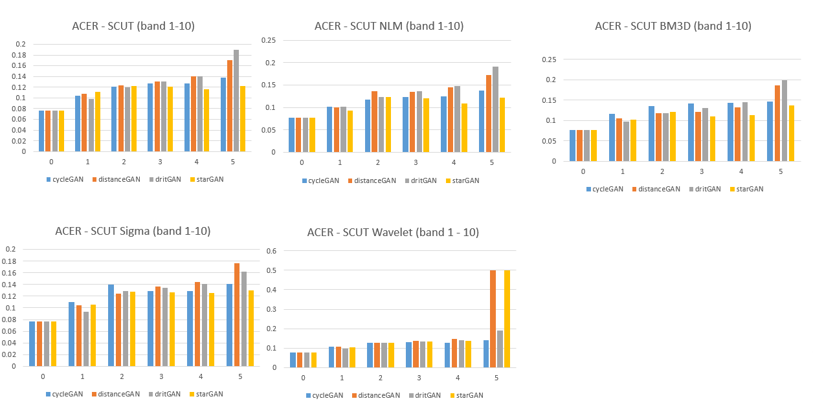
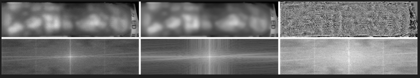
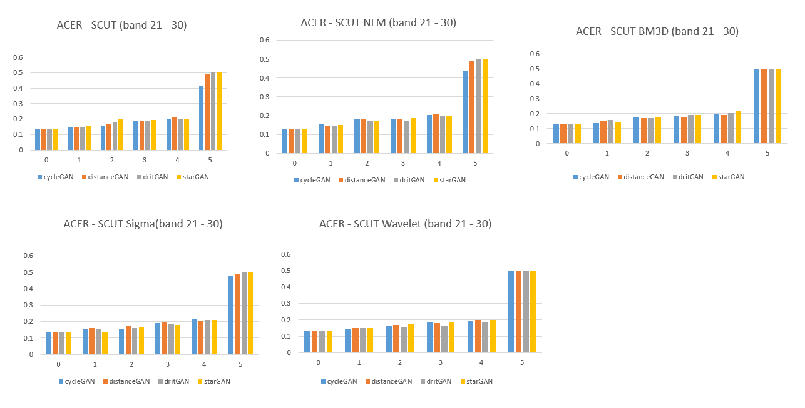
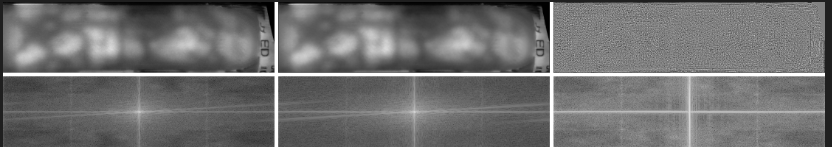
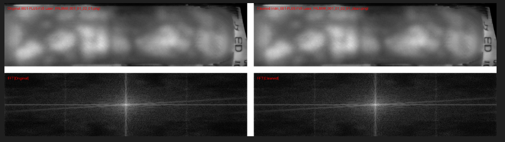
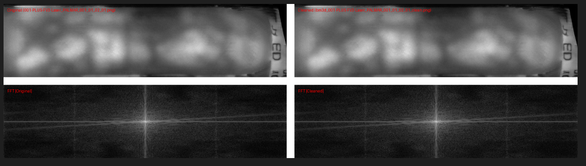
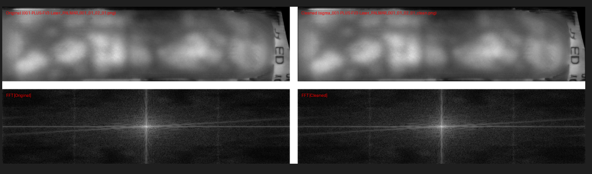
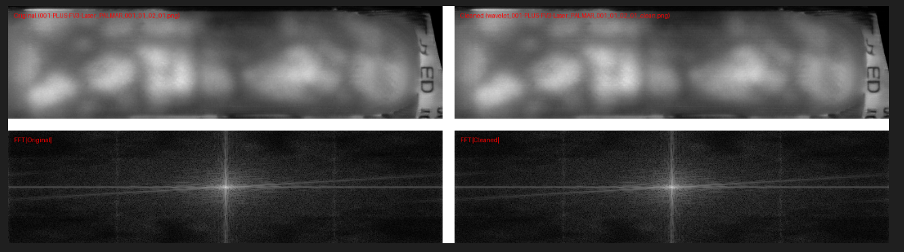

# Removing GAN Model Fingerprints
In this project we try to remove or supress model fingerprints from GANs with selected filters. Francescco Marra, et al, with their paper "Do GANs leave artificial fingerprints?" has been able to show that source attribution can be done on GAN generated images by simply correlating unique noise patterns (PRNU) to the a reference pattern aggregated by the taking the mean on all the synthetic images here: https://doi.org/10.48550/arXiv.1812.11842 . So we attempt to remove these model fingerprints by subtracting the reference pattern noise computed from a collection of images from a particular GAN from the individual images generated by the same GAN to see if this would effectively remove or supress the model fingerprints left by these GANs.

For this project, we would look at results from four filters namely; Non-Local Means (NLM) Filter, BM3D (Block Matching) Filter, Sigma Filter and Wavelet Thresholding Filter. These filters are all characteristically good in preserving image structure while removing random noise.

## Method Overview
* First, the input image is denoised with a selected filter.
* Then the denoised image is subtracted from the original to get the fingerprint.
* The average of fingerprints from a particular GAN is then taken, to get the reference pattern or GAN fingerprint.
* This reference pattern is then subtracted from the individual images from the same GAN.
* Evaluation can be done, if this images can pass for real images.

$D = W(I)$

$F = I - D$
    
$R = \bar{F}$

where;

$\bar{F} = \frac{1}{n}\sum_{i=1}^n F_i$

- \( I \): Original image  
- \( W \): Chosen filter or denoising Function 
- \( D \): Denoised image   
- \( F \): Extracted fingerprint  
- \( R \): Reference pattern computed from fingerprints Fi_s

## Sampled Outputs From Each Filter in Spatial and Fourier Domain
|         Original Image       ||       Denoised Image      ||     Fingerprint      |
- Non-Local Means Filter

- BM3D Filter

- Wavelet Filter

- Sigma Filter

Once the reference patterns for each GAN has been computed, we proceed to manipulate the images from the same GAN with it by subtracting it from them.

$C = I - s * R$

where;
- \( C \): Cleaned image
- \( s \): Strength parameter 

## Sampled Cleaned Image From Each FIlter

#### NLM Filter with SSIM 0.9969

#### BM3D Filter with SSIM 0.9969

#### Sigmma Filter with SSIM 0.9915

#### Wavelet Filter with SSIM 0.9914

## Observation
While we noticed the denoising could extract the pattern noise, especially that wavelet filter. The reference pattern noise computed from the average of these extracted fingerprints did not seem to show much effect when used for cleaning. We know that the more fingerprints that are used to compute the reference pattern, the additive noise component seem to vanish. But we suspect the pattern left afterwards may need some adaptive scaling to effective suppress these pattern noises during clearning.

