# Removing GAN Model Fingerprints
In this project we try to remove or supress model fingerprints from GANs with selected filters. Francescco Marra, et al, with their paper "Do GANs leave artificial fingerprints?" has been able to show that source attribution can be done on GAN generated images by simply correlating unique noise patterns (PRNU) to the a reference pattern aggregated by the taking the mean on all the synthetic images here: https://doi.org/10.48550/arXiv.1812.11842 . So we attempt to remove these model fingerprints by subtracting the reference pattern noise computed from a collection of images from a particular GAN from the individual images generated by the same GAN to see if this would effectively remove or supress the model fingerprints left by these GANs.

For this project, we would look at results from four filters namely; Non-Local Means (NLM) Filter, BM3D (Block Matching) Filter, Sigma Filter and Wavelet Thresholding Filter. These filters are all characteristically good in preserving image structure while removing random noise.

## Method Overview
* First, the input image is denoised with a selected filter.
* Then the denoised image is subtracted from the original to get the fingerprint.
* The average of fingerprints from a particular GAN is then taken, to get the reference pattern or GAN fingerprint.
* This reference pattern is then subtracted from the individual images from the same GAN.
* Evaluation can be done, if this images can pass for real images.

$D = W(I)$

$F = I - D$
    
$R = \bar{F}$

where;

$\bar{F} = \frac{1}{n}\sum_{i=1}^n F_i$

- \( I \): Original image  
- \( W \): Chosen filter or denoising Function 
- \( D \): Denoised image   
- \( F \): Extracted fingerprint  
- \( R \): Reference pattern computed from fingerprints Fi_s

## Sampled Outputs From Each Filter in Spatial and Fourier Domain
|         Original Image       ||       Denoised Image      ||     Fingerprint      |
- Non-Local Means Filter
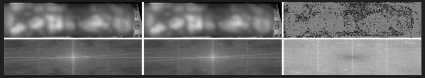
- BM3D Filter
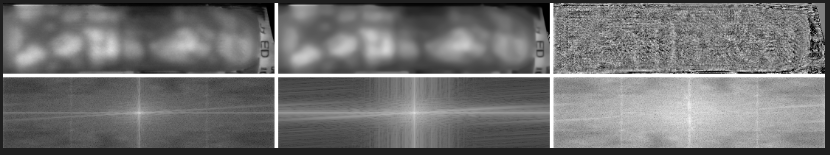
- Wavelet Filter
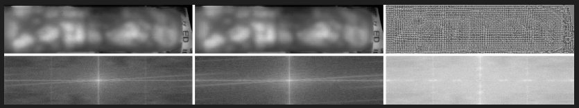
- Sigma Filter
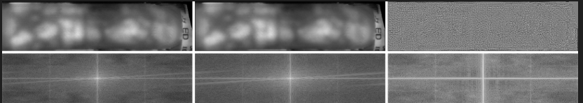

Once the reference patterns for each GAN has been computed, we proceed to manipulate the images from the same GAN with it by subtracting it from them.

$C = I - s * R$

where;
- \( C \): Cleaned image
- \( s \): Strength parameter 

## Sampled Cleaned Image From Each FIlter

#### NLM Filter with SSIM 0.9969
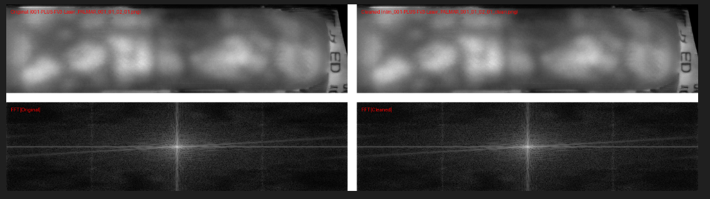
#### BM3D Filter with SSIM 0.9969
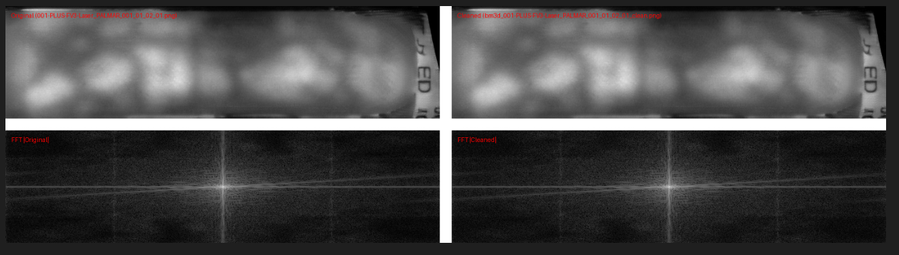
#### Sigmma Filter with SSIM 0.9915
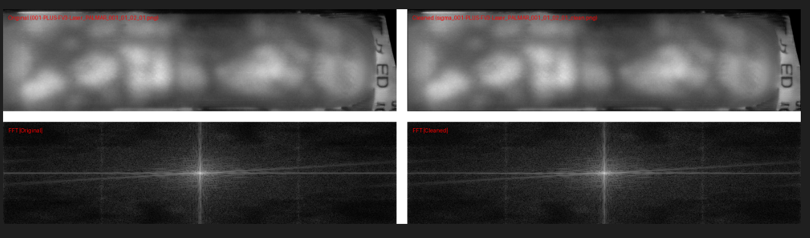
#### Wavelet Filter with SSIM 0.9914
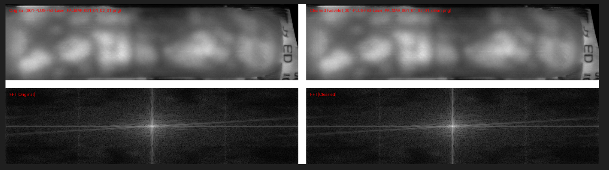

## Observation
The denoising filters, particularly the wavelet filter, effectively suppress the pattern noise. This suggests that the noise is captured well within the extracted "fingerprints" (the difference between the original and denoised images).

However, a fixed reference pattern computed by averaging these fingerprints fails to completely remove the noise when subtracted from the original images. The issue is likely that the residual pattern is too subtle to be removed by a simple, one-size-fits-all subtraction.

To improve the cleaning process, a more effective strategy is to implement adaptive scaling. This could provide a close approximation of the reference pattern on a per-image basis to match the unique intensity of the noise in each image. But there is an immediate limitation with this process. The filtering only targets the noisy patterns of high frequencies while the low frequency component of these fingerprints are barely ectracted. This was observed when the filtered images were tested with the PAD system we deisgned <a href="https://github.com/njPlanck/Presentation-Attack-Detection-System.git">here</a>.

### The Average Classification Error Rate (ACER) from the fourier features within the first 0-10 bands with the SCUT dataset as can be found <a href="https://www.cosy.sbg.ac.at/~uhl/bva.html">here</a>.
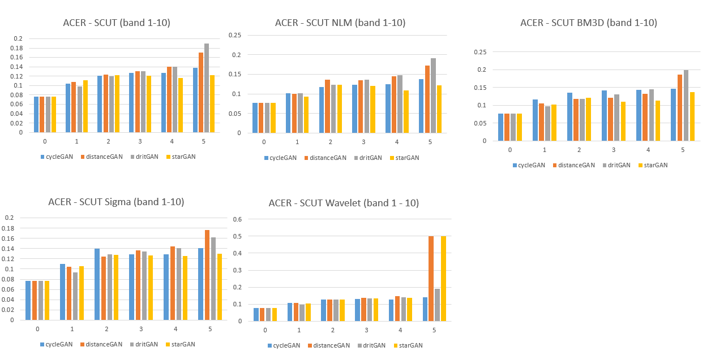

### The Average Classification Error Rate (ACER) from the fourier features within the first 10-20 bands

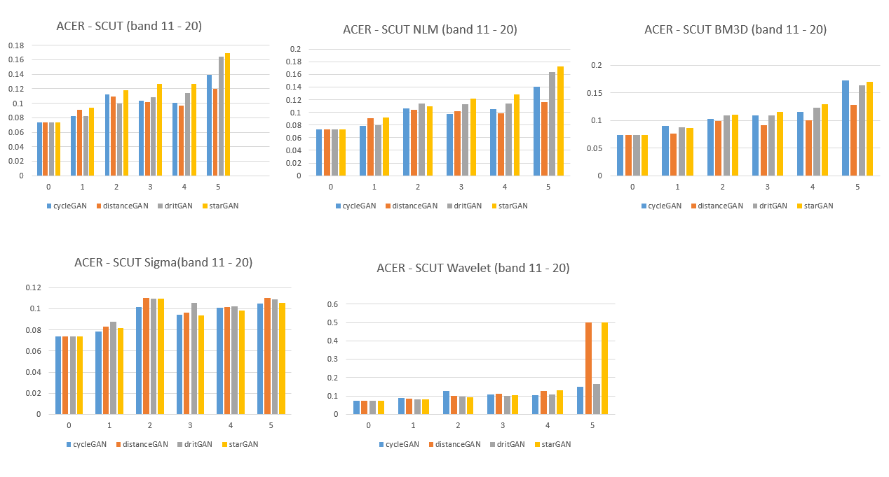

### The Average Classification Error Rate (ACER) from the fourier features within the first 20-30 bands
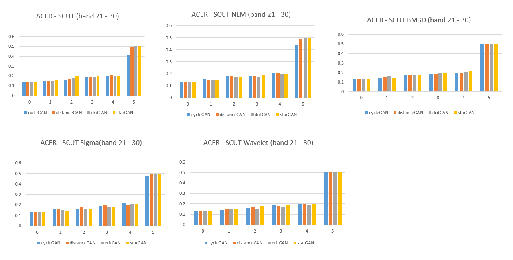

So we can imediately see that even though the this process was not effective for the dataset it was applied with. And while a more agressive technique could work, it would defeat the fundamental objective, which is to remove these artifacts without altering the visual fidelity of the images.
